# 报告一

# 一、KNN 原理简述

K 近邻(K-Nearest Neighbors,KNN)是监督学习的惰性学习方法,基本思想是"物以类聚":对查询点 $x$,在训练集中找到距离最近的 $k$ 个样本 $N_k(x)$,由它们的标签推断 $x$ 的标签。

**分类**:多数投票,
$$\hat{y} = \arg\max_c \sum_{i \in N_k(x)} \mathbb{1}[y_i = c]$$

**回归**:近邻目标值的均值,
$$\hat{y} = \frac{1}{k}\sum_{i \in N_k(x)} y_i$$

**距离度量**:本题目实现欧氏距离与曼哈顿距离(Minkowski 距离 $p=2$ 与 $p=1$ 的特例):
$$d_E(x_i,x_j)=\sqrt{\sum_r (x_{ir}-x_{jr})^2},\qquad d_M(x_i,x_j)=\sum_r |x_{ir}-x_{jr}|$$

**评估指标**:分类用准确率 $\mathrm{Acc}$;回归用均方误差 $\mathrm{MSE}$、平均绝对误差 $\mathrm{MAE}$ 与决定系数 $R^2$:
$$\mathrm{MSE}=\frac{1}{n}\sum_i(\hat y_i-y_i)^2,\qquad R^2=1-\frac{\sum_i(\hat y_i-y_i)^2}{\sum_i(y_i-\bar y)^2}$$

**核心超参数 $k$**:$k$ 小时模型只依赖少数近邻,决策边界曲折、对训练数据敏感(低偏差、高方差);$k$ 大时预测被大量近邻平均,边界平滑(高偏差、低方差)。第 4.1 节给出两个数据集的 $k$-敏感性曲线实测结果。

# 二、实验设置

**数据集**

- 分类:Iris(150 样本 × 4 特征 × 3 类,特征均为 cm 量纲);
- 回归:Concrete Compressive Strength(1030 样本 × 8 特征,目标为抗压强度 MPa)。

**环境**:Python 3.13,Windows 11,主要使用的包为 numpy / pandas / scikit-learn。手算例子见附录。运行步骤见README.md

# 三、实验结果(任务 2)

表 1:Iris 分类准确率(5 折 CV,均值 ± 标准差,无加权)

| k | 曼哈顿 | 欧氏 |
|---|---:|---:|
| 1 | 0.9467 ± 0.0267 | 0.9533 ± 0.0340 |
| 3 | 0.9600 ± 0.0133 | 0.9600 ± 0.0133 |
| 5 | 0.9467 ± 0.0163 | 0.9600 ± 0.0133 |
| 7 | 0.9533 ± 0.0340 | 0.9667 ± 0.0298 |
| 9 | 0.9533 ± 0.0163 | **0.9733 ± 0.0249** |
| 11 | 0.9533 ± 0.0163 | 0.9667 ± 0.0211 |
| 13 | 0.9667 ± 0.0211 | 0.9600 ± 0.0249 |
| 15 | 0.9667 ± 0.0211 | 0.9533 ± 0.0163 |

表 2:Concrete 回归 MSE / MAE / R²(5 折 CV,均值 ± 标准差,无加权)

| k | MSE(曼哈顿) | MAE(曼哈顿) | R²(曼哈顿) | MSE(欧氏) | MAE(欧氏) | R²(欧氏) |
|---|---:|---:|---:|---:|---:|---:|
| 1 | 96.86 ± 13.56 | 6.750 ± 0.328 | 0.648 ± 0.064 | 85.20 ± 15.78 | 6.320 ± 0.454 | 0.690 ± 0.070 |
| 3 | 91.75 ± 10.42 | 7.098 ± 0.481 | 0.669 ± 0.040 | 76.25 ± 7.39 | 6.479 ± 0.302 | 0.725 ± 0.027 |
| 5 | 81.73 ± 8.72 | 6.909 ± 0.432 | 0.706 ± 0.018 | 78.37 ± 9.69 | 6.734 ± 0.375 | 0.718 ± 0.027 |
| 7 | 80.49 ± 10.77 | 6.861 ± 0.520 | 0.711 ± 0.024 | 85.45 ± 12.78 | 7.059 ± 0.473 | 0.694 ± 0.033 |
| 9 | 81.42 ± 12.84 | 6.993 ± 0.553 | 0.709 ± 0.027 | 87.94 ± 14.74 | 7.253 ± 0.524 | 0.685 ± 0.041 |
| 11 | 85.85 ± 12.44 | 7.196 ± 0.503 | 0.693 ± 0.024 | 94.73 ± 15.99 | 7.586 ± 0.549 | 0.661 ± 0.042 |
| 13 | 90.13 ± 12.59 | 7.426 ± 0.520 | 0.677 ± 0.025 | 96.72 ± 14.98 | 7.706 ± 0.527 | 0.653 ± 0.038 |
| 15 | 95.14 ± 14.28 | 7.679 ± 0.585 | 0.660 ± 0.028 | 100.11 ± 16.18 | 7.829 ± 0.592 | 0.641 ± 0.040 |

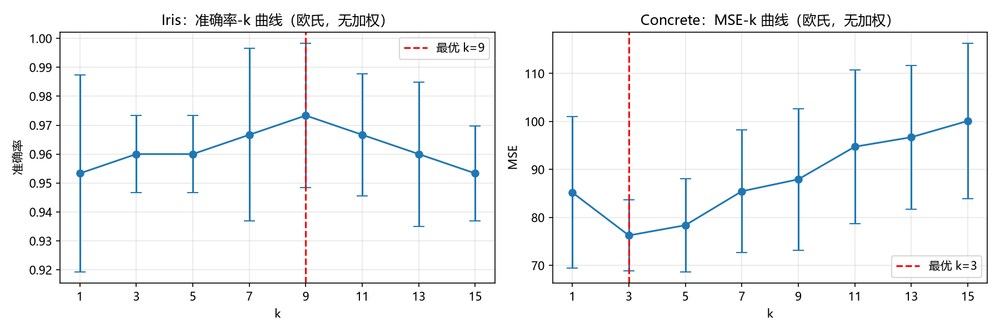{width=100%}

**测试时间**:Iris 约 0.001 s / 次 5 折 CV,Concrete 约 0.07–0.11 s / 次。时间几乎不随 $k$ 变化。

# 四、任务 

## 4.1 $k$ 值如何影响偏差与方差?

偏差-方差视角下,$k$ 越小预测越依赖单个近邻(高方差、低偏差),$k$ 越大预测被更多近邻平均(低方差、高偏差)。两个数据集的实测曲线(图 1):

- **Iris(准确率)**:$k=1$ 时 0.9533 ± 0.0340,随 $k$ 增大准确率先升后降,在 **$k=9$ 处达最优 0.9733 ± 0.0249**;折间标准差从 $k=1$ 的 0.0340 降到 $k=9$ 的 0.0249。
- **Concrete(MSE)**:$k=1$ 时 85.20 ± 15.78,$k$ 增大后 MSE 先降后升,在 **$k=3$ 处达最优 76.25 ± 7.39**,随后持续上升($k=15$ 时 100.11 ± 16.18)。

实测结果:两个数据集都存在各自的最优 $k$(Iris $k=9$、Concrete $k=3$);Iris 的折间标准差随 $k$ 从 1 增到 9 由 0.0340 降到 0.0249。

## 4.2 标准化前后对比

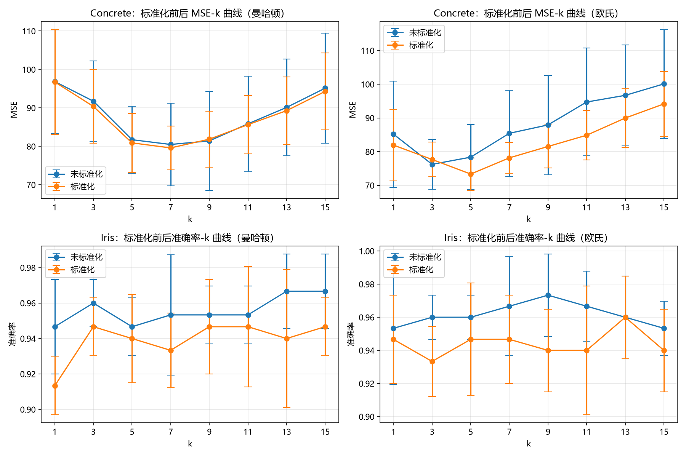{width=100%}

**Concrete:标准化后 MSE 更低。** 欧氏距离下最优 MSE 由 76.25($k=3$)降到 73.36($k=5$),降幅 3.8%;16 组(2 距离 × 8 个 $k$)对比中 14 组标准化后 MSE 更低(如 $k=1$:85.20 → 81.95;$k=15$:100.11 → 94.17),2 组略高(欧氏 $k=3$:76.25 → 77.69;曼哈顿 $k=9$:81.42 → 81.86);曼哈顿距离下最优 MSE 由 80.49 降到 79.60。特征量纲:8 个特征中 7 个是每立方米配比(Cement 102~540 kg/m³、Coarse Aggregate 801~1145 kg/m³ 等),Age 为 1~365 day。

**Iris:标准化后准确率反而下降。** 欧氏距离最优准确率由 0.9733($k=9$)降到 0.9600($k=13$);曼哈顿距离最优准确率由 0.9667($k=13/15$)降到 0.9467。Iris 的 4 个特征均为 cm 量纲(花萼/花瓣长宽),数值范围 0.1~7.9。

**实测结论**:两个数据集上标准化效果相反:Concrete(量纲不一致)标准化后 MSE 下降,Iris(同量纲)标准化后准确率下降。

## 4.3 欧氏与曼哈顿距离的对比

**(1) 两个数据集上的结论是否一致?** 一致:两个数据集上欧氏距离都优于曼哈顿距离(Iris:0.9733 对 0.9667;Concrete:76.25 对 80.49,均为各自最优 $k$)。差距都不大;Iris 上曼哈顿的最优 $k$ 为 13/15,欧氏为 9。

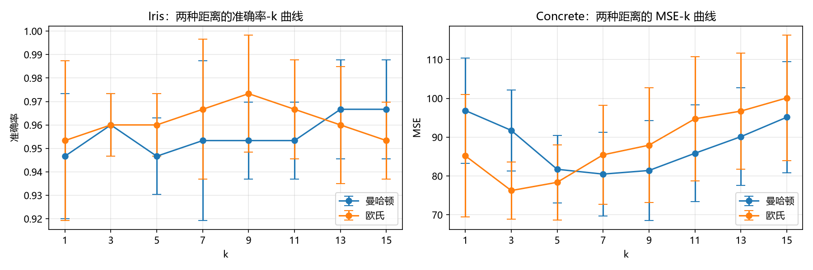{width=100%}

**(2) "曼哈顿距离对离群点更鲁棒"是否得到验证?** 是。受控注入实验:固定 $k=5$ 与同一 CV 划分,对 Concrete 验证折随机抽 2% / 5% 的样本,每个抽中样本的随机一维特征 ×20 作为离群点,比较两种距离相对无注入基线的 MSE 增幅(5 次随机注入,均值 ± 标准差):

| 距离 | 注入 2% | 注入 5% |
|---|---:|---:|
| 曼哈顿 | +1.46 ± 0.88 | +3.20 ± 2.42 |
| 欧氏 | +6.34 ± 2.71 | +13.16 ± 3.60 |

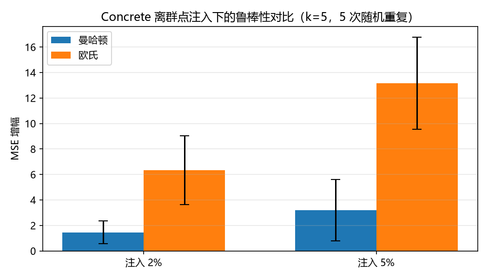{width=70%}

注入 2% 离群点时欧氏的 MSE 增幅是曼哈顿的 4.3 倍,注入 5% 时为 4.1 倍。两种距离的公式上,欧氏对逐维差值取平方,曼哈顿取绝对值。本实验的注入条件下,曼哈顿距离的 MSE 增幅更小。

## 4.4 近邻均值改为近邻中位数:MSE 如何变化?

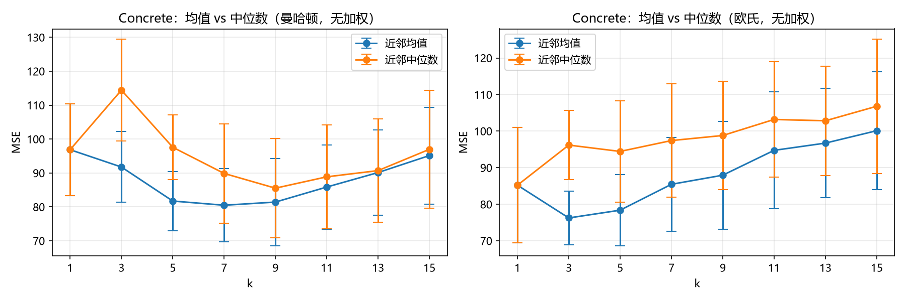{width=100%}

中位数在**所有 $k$ 与两种距离下都劣于均值**:欧氏距离下均值最优 MSE 为 76.25($k=3$),中位数最优仅有 85.20 且退化为 $k=1$(此时中位数即该近邻本身);同 $k$ 直接对比同样如此(如欧氏 $k=5$:78.37 对 94.44)。曼哈顿距离下均值最优 80.49($k=7$),中位数最优 85.52($k=9$)。

**目标值分布**(实测):偏度 0.42,范围 2.33~82.60 MPa,没有样本超出均值 ± 3σ(0/1030)。在 MSE 损失下,均值是使平方损失最小的估计(数学性质)。本实验数据上中位数在所有 $k$ 与两种距离下 MSE 均高于均值。

# 五、距离加权投票与加权均值

权重取 $w_i = 1/(d_i + \varepsilon)$($\varepsilon = 10^{-10}$)

**回归(Concrete):加权后 MSE 明显下降。** 欧氏距离最优 MSE 由 76.25(无加权)降到 **62.72**(加权,$k=5$),降幅 17.7%;曼哈顿距离由 80.49 降到 **65.97**($k=9$),降幅 18.0%。Concrete 数据中有 25 行完全重复、354 对样本在原始特征上的距离小于 1;权重公式 $w_i=1/(d_i+\varepsilon)$ 使这些近零距离样本获得较大权重。

**分类(Iris):加权后准确率反而略降。** 欧氏距离最优准确率 0.9667(无加权 0.9733),曼哈顿 0.9533(无加权 0.9667)。

实测结论:本实验中,回归(Concrete)加权后 MSE 明显下降,分类(Iris)加权后准确率略降。附加表格见附录 A(完整加权结果表)。

# 附录 A:距离加权完整结果表

表 A1:Iris 分类准确率(加权投票)

| k | 曼哈顿 | 欧氏 |
|---|---:|---:|
| 1 | 0.9467 ± 0.0267 | 0.9533 ± 0.0340 |
| 3 | 0.9600 ± 0.0133 | 0.9600 ± 0.0133 |
| 5 | 0.9467 ± 0.0163 | 0.9600 ± 0.0133 |
| 7 | 0.9533 ± 0.0163 | 0.9600 ± 0.0249 |
| 9 | 0.9533 ± 0.0163 | 0.9667 ± 0.0211 |
| 11 | 0.9533 ± 0.0163 | 0.9667 ± 0.0211 |
| 13 | 0.9533 ± 0.0163 | 0.9667 ± 0.0211 |
| 15 | 0.9533 ± 0.0163 | 0.9600 ± 0.0133 |

表 A2:Concrete 回归(加权均值)

| k | MSE(曼哈顿) | R²(曼哈顿) | MSE(欧氏) | R²(欧氏) |
|---|---:|---:|---:|---:|
| 1 | 96.86 ± 13.56 | 0.648 ± 0.064 | 85.20 ± 15.78 | 0.690 ± 0.070 |
| 3 | 78.07 ± 9.09 | 0.717 ± 0.048 | 66.18 ± 9.88 | 0.760 ± 0.045 |
| 5 | 69.28 ± 7.89 | 0.749 ± 0.039 | **62.72 ± 9.85** | **0.773 ± 0.043** |
| 7 | 66.38 ± 8.33 | 0.760 ± 0.035 | 63.74 ± 10.63 | 0.770 ± 0.040 |
| 9 | **65.97 ± 7.99** | **0.762 ± 0.031** | 65.87 ± 10.85 | 0.762 ± 0.040 |
| 11 | 66.64 ± 7.76 | 0.760 ± 0.028 | 68.94 ± 11.10 | 0.752 ± 0.039 |
| 13 | 67.91 ± 8.00 | 0.755 ± 0.029 | 70.18 ± 10.67 | 0.747 ± 0.038 |
| 15 | 69.68 ± 8.15 | 0.749 ± 0.028 | 71.74 ± 11.43 | 0.742 ± 0.039 |

# 附录 B:手算例子复现(任务 1 初验)

运行 `q1_task1_manual_check.py` 的输出:

```text
分类例子 q=(3,2), k=3: 预测 = A(期望 A)
回归例子 x=4, k=2: 预测 = 4.5000(期望 4.5000)
回归例子 x=4, k=3: 预测 = 3.8333(期望 3.8333)
全部例子通过
```


# 报告二：KNN 的三种距离方案——欧氏距离、马氏距离与 ReliefF 特征加权的实现与比较
# 一、马氏距离、ReliefF 简介

**马氏距离**：

**背景**:欧氏距离把各特征视为等权且相互独立。当特征量纲不一或相互相关时,距离会被大方差、强相关的方向主导,几何上失真。马氏距离(Mahalanobis, 1936)先用协方差矩阵把特征空间"解相关 + 标准化",再量欧氏距离,从而得到与坐标尺度无关的统计距离,最早用于判别分析,后被广泛用作 kNN 等方法的距离度量。

**例如**:一个数据点 (180cm, 60kg) 和 (190cm, 60kg) 的欧氏距离，与 (180cm, 60kg) 和 (180cm, 70kg) 的欧氏距离相同，但这在物理意义上明显不合理。
马氏距离通过 Σ⁻¹ 对数据进行“旋转”和“缩放”：

- 旋转：消除特征间的相关性（协方差非对角项）。
- 缩放：将各维度的方差归一化（对角项）。

**再比如**：
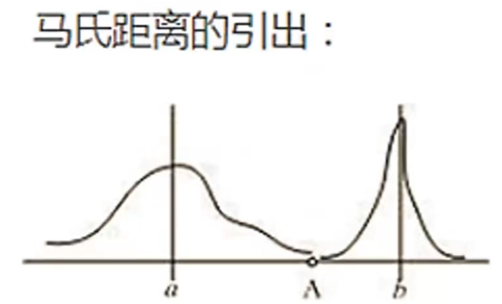{width=40%}

从图片来看，A 点到 a 分布的欧氏距离比 b 分布更远，但是 A 距离 a 分布的距离更近，也就是说 A 属于 a 分布的概率更大

因此，马氏距离实际上是在一个变换后的空间中计算欧氏距离，或者说马氏距离在计算点（向量）到一个分布的距离（或理解为点属于一个分布的概率）。

**公式**:
$$d_M(x_i,x_j)=\sqrt{(x_i-x_j)^{\top}\Sigma^{-1}(x_i-x_j)}=\big\|\Sigma^{-1/2}(x_i-x_j)\big\|_2$$
其中 $\Sigma$ 为特征协方差矩阵,作业预定义为用全部训练样本估计的全局协方差($\Sigma=X^{c\top}X^c/(n-1)$,$X^c$ 为中心化后的训练矩阵);$\Sigma=I$ 时退化为欧氏距离。

**是否利用类别信息**:否。$\Sigma$ 由全体训练样本(不分类别)估计,标签不参与距离构造。

**是否考虑特征间相关性**:是。满矩阵 $\Sigma^{-1}$ 同时完成各特征尺度归一与特征间解相关,对特征的任意满秩线性变换保持不变(尺度不变性)。


**ReliefF**：

**背景**:Relief(Kira & Rendell, 1992)为特征选择提出"好特征让同类样本接近、异类样本远离"的思想:对随机抽出的样本,比较它与同类最近邻(near-hit)、异类最近邻(near-miss)在特征上的差异,据此估计各特征的判别力;ReliefF(Kononenko, 1994)将其推广到多分类与 $k$ 近邻平均,并提高了对噪声的容忍度。把学到的权重用于构造加权距离,即监督式的距离度量学习。

**公式**:对每个抽样样本 $x_i$,设其同类近邻集合为 $H$、异类 $c$ 的近邻集合为 $M_c$、类先验为 $P(c)$,逐特征权重更新(共迭代 $m$ 次)与加权距离为
$$w_r \leftarrow w_r-\frac{1}{mk}\sum_{x_h\in H}(x_{ir}-x_{hr})^2+\frac{1}{mk}\sum_{c\neq c_i}\frac{P(c)}{1-P(c_i)}\sum_{x_t\in M_c}(x_{ir}-x_{tr})^2,\qquad d_R(x_i,x_j)=\sqrt{\sum_r w_r\,(x_{ir}-x_{jr})^2}$$

**是否利用类别信息**:是。near-hit / near-miss 由标签确定,权重是利用类别信息监督学得的。

**是否考虑特征间相关性**:否。权重 $w$ 为对角形式,各特征独立加权,不建模特征间的协方差/相关性。


# 二、三种距离方案简介

**欧氏距离**:各特征等权,距离为逐维平方差的平方根。不利用类别信息、不考虑特征相关性。这里直接复用题目一的手写 KNN。

**马氏距离**:用训练数据的全局协方差 $\Sigma$ 构造白化矩阵 $\Sigma^{-1/2}$,先对特征空间做白化再计算欧氏距离,相当于度量 $(x_i-x_j)^{\top}\Sigma^{-1}(x_i-x_j)$。它利用特征间的相关结构(满矩阵),并具有尺度不变性:对特征做任意满秩线性变换,马氏距离保持不变。实现要点:协方差 $\Sigma = X^{c\top}X^c/(n-1)$ 用特征分解求 $\Sigma^{-1/2}$(特征值取倒数并开方,等价于手写求逆,另加 $10^{-10}$ 量级微正则防奇异);5 折交叉验证中 $\Sigma$ 只在训练折上估计,测试折只做白化变换,防止数据泄漏。

**ReliefF 加权距离**:以监督方式学习各特征的权重 $w$:对每个抽样样本,同类最近邻(near-hit)的逐特征平方差使权重减小,每个异类最近邻(near-miss)的逐特征平方差使权重增大(异类项按先验 $P(c)/(1-P(c_i))$ 加权),迭代 $m$ 次后平均;距离为 $\sqrt{\sum_r w_r(x_{ir}-x_{jr})^2}$。它利用类别信息学习对角权重,但不考虑特征间相关性。实现要点:权重更新;$\sqrt{\max(w,0)}$ 缩放特征后复用题目一 KNN(负权重特征被剔除);超参 $m=n$(遍历全部训练样本)、类内/类外近邻数 $k_{\text{relief}}=5$、先验加权开启;交叉验证中权重只在训练折上学习。

# 三、实验设置

**数据集**(来源:[UCI Wine](https://archive.ics.uci.edu/ml/datasets/wine)、[UCI WDBC](https://archive.ics.uci.edu/ml/datasets/Breast+Cancer+Wisconsin+(Diagnostic))、合成数据自生成):

| 数据集 | 样本 | 特征 | 类别 | 说明 |
|---|---|---|---|---|
| Wine | 178 | 13 | 3 | 化学分析指标,特征相关性较强 |
| WDBC | 569 | 30 | 2 | 细胞核形态特征,冗余特征多 |
| 合成(含噪) | 600 | 40 | 3 | 10 维有效高斯簇(类中心 0/2/4,$\sigma=1$)+ 30 维 U(0,1) 均匀噪声 |
| 合成(纯净) | 600 | 10 | 3 | 10 维有效特征 |

**环境**:Windows 11,Intel 64 位 CPU,Python 3.13,NumPy;单线程运行。

# 三、实验结果

表 3:Wine 分类准确率(5 折 CV,均值 ± 标准差)

| k | 欧氏 | 马氏 | ReliefF |
|---|---:|---:|---:|
| 1 | 0.9546 ± 0.0389 | 0.9325 ± 0.0378 | 0.9433 ± 0.0405 |
| 3 | 0.9490 ± 0.0380 | 0.9379 ± 0.0451 | 0.9492 ± 0.0279 |
| 5 | 0.9549 ± 0.0286 | 0.9435 ± 0.0402 | 0.9548 ± 0.0291 |
| 7 | **0.9660 ± 0.0281** | 0.9549 ± 0.0226 | **0.9660 ± 0.0281** |
| 11 | **0.9660 ± 0.0281** | 0.9378 ± 0.0458 | **0.9660 ± 0.0420** |

表 4:WDBC 分类准确率(5 折 CV,均值 ± 标准差)

| k | 欧氏 | 马氏 | ReliefF |
|---|---:|---:|---:|
| 1 | 0.9525 ± 0.0215 | 0.8242 ± 0.0082 | 0.9455 ± 0.0142 |
| 3 | **0.9736 ± 0.0217** | 0.8120 ± 0.0162 | 0.9683 ± 0.0106 |
| 5 | 0.9718 ± 0.0152 | 0.8137 ± 0.0239 | 0.9683 ± 0.0091 |
| 7 | 0.9701 ± 0.0154 | 0.7891 ± 0.0155 | **0.9701 ± 0.0183** |
| 11 | 0.9666 ± 0.0180 | 0.7803 ± 0.0143 | 0.9683 ± 0.0072 |

表 5:合成数据(40 维含噪)分类准确率(5 折 CV,均值 ± 标准差)

| k | 欧氏 | 马氏 | ReliefF |
|---|---:|---:|---:|
| 1 | 0.9217 ± 0.0287 | 0.5033 ± 0.0375 | 0.9950 ± 0.0067 |
| 3 | 0.9533 ± 0.0100 | 0.5533 ± 0.0340 | 0.9983 ± 0.0033 |
| 5 | 0.9800 ± 0.0125 | 0.5833 ± 0.0293 | 0.9983 ± 0.0033 |
| 7 | 0.9883 ± 0.0041 | 0.5700 ± 0.0393 | 0.9983 ± 0.0033 |
| 11 | **0.9950 ± 0.0041** | 0.6017 ± 0.0193 | **1.0000 ± 0.0000** |

表 6:合成数据(纯净 10 维,噪声鲁棒性实验的对照)分类准确率(5 折 CV,均值 ± 标准差)

| k | 欧氏 | 马氏 | ReliefF |
|---|---:|---:|---:|
| 1 | 0.9967 ± 0.0067 | 0.7517 ± 0.0322 | 0.9967 ± 0.0067 |
| 3 | **1.0000 ± 0.0000** | 0.8050 ± 0.0296 | 0.9983 ± 0.0033 |
| 5 | **1.0000 ± 0.0000** | 0.8083 ± 0.0384 | 0.9983 ± 0.0033 |
| 7 | 0.9983 ± 0.0033 | 0.8333 ± 0.0361 | 0.9983 ± 0.0033 |
| 11 | **1.0000 ± 0.0000** | 0.8400 ± 0.0143 | 0.9983 ± 0.0033 |

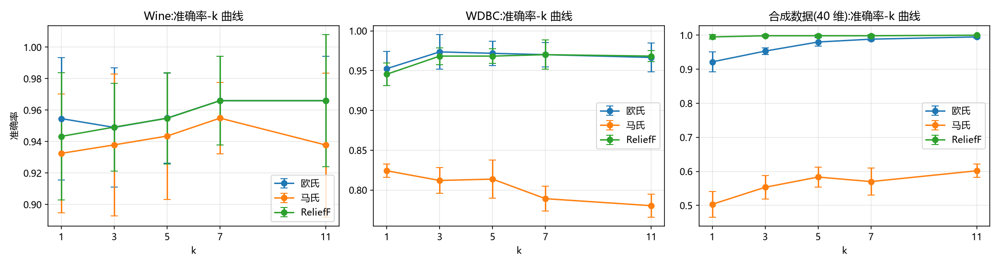{width=100%}

# 四、任务 3

## 4.1 马氏与 ReliefF 相对欧氏基线各带来多大提升?Wine 与 WDBC 上结论是否一致?

各方法取各自最优 $k$ 时的准确率与相对欧氏的差值:

| 数据集 | 欧氏 | 马氏(Δ) | ReliefF(Δ) |
|---|---:|---:|---:|
| Wine | 0.9660 (k=7) | 0.9549 (−0.011) | 0.9660 (+0.000) |
| WDBC | 0.9736 (k=3) | 0.8242 (−0.149) | 0.9701 (−0.004) |
| 合成 40 维 | 0.9950 (k=11) | 0.6017 (−0.393) | 1.0000 (+0.005) |

**实测结论:三个数据集上马氏的最优准确率均低于欧氏(差值 −0.011/−0.149/−0.393);ReliefF 与欧氏持平或略高(Wine +0.000、WDBC −0.004、合成 +0.005)。**

补充的实测事实:(1) **Wine**:5 折 CV 下训练折约 142 个样本(178×4/5),马氏在其上估计 13×13 协方差。(2) **WDBC**:30 个特征间有 140 对特征 $|r|>0.7$、42 对 $|r|>0.9$;马氏准确率随 $k$ 增大持续下降(表 4:$k=1$ 时 0.8242,$k=11$ 时 0.7803)。(3) **合成数据**:30 维噪声为 U(0,1),方差为 1/12,小于有效维的方差 1;白化后各方向方差均为 1(白化的定义),噪声维在距离中与有效维等权;此时马氏准确率 0.6017。ReliefF 在合成数据上学到的噪声维权重均值为 0.049、有效维 1.814(见 4.3),准确率 1.0000。

## 4.2 满矩阵 $\Sigma^{-1}$ 与对角权重:两种方案各在什么数据上体现优劣?

马氏学习满矩阵 $\Sigma^{-1}$,利用特征间相关性;ReliefF 学习对角权重,假设特征独立。Wine 数据的相关系数矩阵(图 6)显示强相关确实存在:total_phenols 与 flavanoids $r=0.865$、flavanoids 与 od280/od315 $r=0.787$、total_phenols 与 od280/od315 $r=0.700$、flavanoids 与 proanthocyanins $r=0.653$、alcohol 与 proline $r=0.644$。

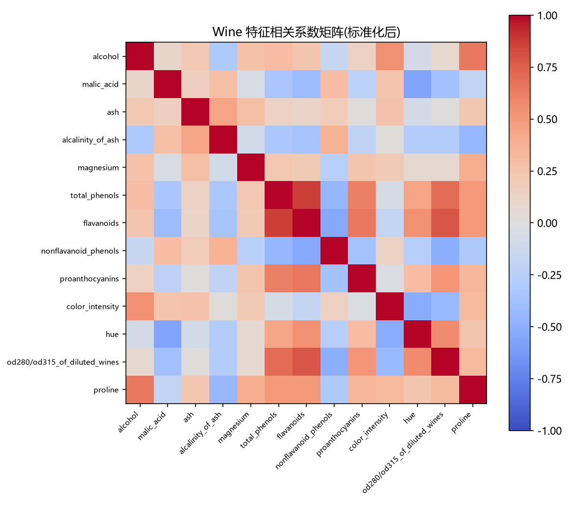{width=65%}

Wine 存在上述强相关,但马氏在 Wine 上的最优准确率 0.9549 低于欧氏的 0.9660(表 3);三个数据集上马氏均低于欧氏(4.1)。$\Sigma^{-1}$ 等价于对低方差方向放大权重(公式性质);在 WDBC(表 4)与含噪合成数据(表 5)上马氏准确率最低。ReliefF 忽略特征间相关性,学到的噪声维权重接近 0(4.3),在三个数据集上准确率与欧氏持平或更高(表 3~5)。

## 4.3 合成噪声数据:哪种方法受噪声特征影响最小?ReliefF 的噪声权重是否接近 0?

注入 30 维噪声特征前后的准确率(各方法取纯净数据上的最优 $k$):

| 方法 | 纯净 10 维 | 含噪 40 维 | 下降幅度 |
|---|---:|---:|---:|
| 欧氏 | 1.0000 (k=3) | 0.9533 | −0.047 |
| 马氏 | 0.8400 (k=11) | 0.6017 | −0.238 |
| ReliefF | 0.9983 (k=3) | 0.9983 | **0.000** |

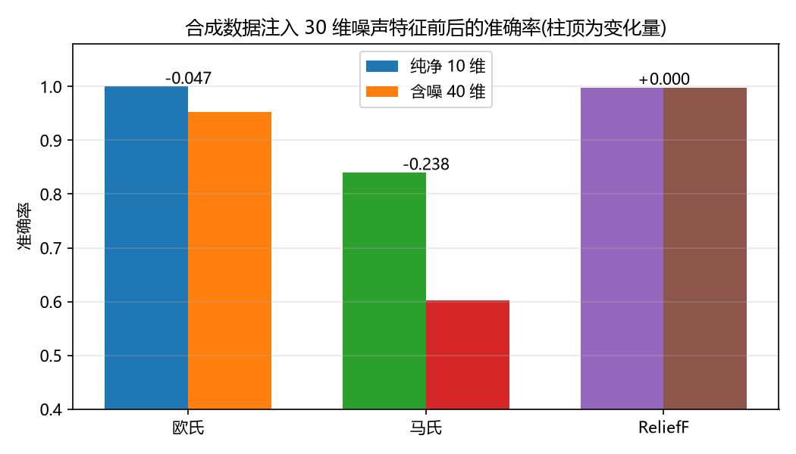{width=70%}

**受噪声特征影响最小的是 ReliefF,准确率几乎无损;欧氏损失约 5 个百分点;马氏损失 24 个百分点。**

ReliefF 权重统计(5 折,每折在训练折上学习,均值 ± 标准差):

- 10 个有效维权重均值:**1.814 ± 0.074**;
- 30 个噪声维权重均值:**0.049 ± 0.045**,仅为有效维的 1/37;
- 噪声维中权重 ≤ 0 的占 13%,权重低于有效维均值 5% 的占 80%。

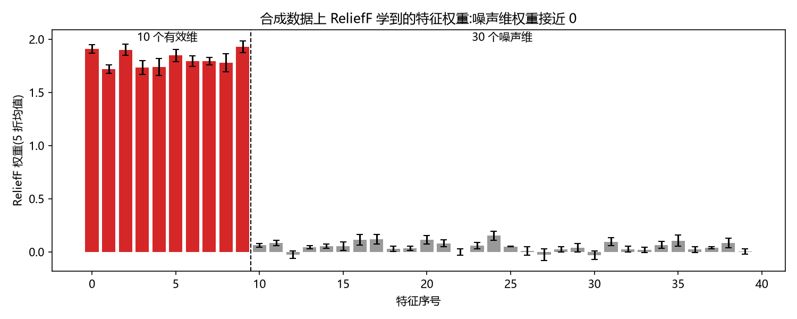{width=85%}

统计:ReliefF 学到的噪声特征权重**接近 0 甚至为负**;实现中按 $\sqrt{\max(w,0)}$ 缩放特征,负权重特征不参与距离计算。同条件下 ReliefF 准确率 0.9983(纯净)→ 0.9983(含噪),几乎无损。

## 4.4 三种方法的计算开销如何随 n、d 增长?

记 n 为训练样本数、m 为测试样本数、d 为特征数、r 为 ReliefF 的迭代次数。三种方法的时间和空间复杂度如下(按实现逐步骤计算,空间取峰值):

表 7:三种方法的时间与空间复杂度

| 方法 | 训练时间 | 训练额外空间 | 测试时间 | 测试空间 |
|---|---:|---:|---:|---:|
| 欧氏 | O(1) | 0 | O(m·n·d) | O(m·n·d) |
| 马氏 | O(n·d²+d³) | O(d²) | O(m·d²+m·n·d) | O(m·n·d) |
| ReliefF | O(r·n·d+r·n·log n) | O(n·d) | O(m·d+m·n·d) | O(m·n·d) |

**欧氏**:训练时只保存数据,时间 O(1)、空间 O(n·d)。测试时每个测试样本都要与全部 n 个训练样本逐个算距离(每对要算 d 维),实现中会生成并保存完整的距离矩阵,再对每行排序取前 k 个,因此测试时间和空间都是 O(m·n·d),排序另加每行 O(n·log n)。这也是三种方法共同的测试开销。

**马氏**:训练时先估计 d×d 的协方差矩阵(O(n·d²)),再求它的逆矩阵(实现上用特征值分解,O(d³)),并保存这两个 d×d 矩阵(空间 O(d²)),最后把训练数据整体变换一次(O(n·d²))。测试时对测试数据做同样的变换,之后与欧氏相同。因此训练时间随 n 线性增长、随 d 立方增长。

**ReliefF**:训练要循环 r 次(本实验 r=n,每个训练样本都当一次基准),每轮都要算当前样本到其余所有样本的逐特征平方差(O(n·d))、按类排序找 k_relief=5 个近邻(O(n·log n)),再更新权重。合计 O(r·n·d+r·n·log n)=O(n²·d+n²·log n);空间只多权重向量 O(d) 和每轮复用的平方差矩阵 O(n·d)。测试时按学到的权重把特征缩放一遍,之后与欧氏相同。因此训练时间随 n 平方增长。

**实验设置**:合成数据。固定 d=40,取 n=150、300、450、600、900、1200;固定 n=600,取 d=10、20、40;训练/测试按 8:2 划分,k=5,每个组合重复 3 次取中位数(perf_counter 计时)。注意:训练集和测试集都随 n 变大,所以测试时间理论上按 n² 增长,而不是按 n。

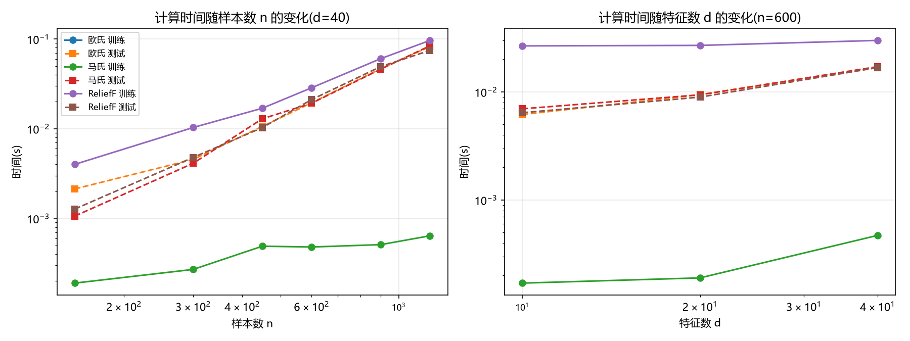{width=100%}

**实测结果:n 方向(d=40)**

训练时间:欧氏在记录精度(5 位小数)内为 0.00000 s。马氏从 n=150 的 0.19 ms 增到 n=1200 的 0.64 ms——n 放大 8 倍、时间约 3.4 倍,低于线性(8 倍);训练中随 n 增长的只有协方差估计,求逆、白化、保存数据等步骤与 n 无关。ReliefF 从 4.0 ms 增到 96.3 ms——n 放大 8 倍、时间约 24 倍,低于理论平方(64 倍);按实现,每轮循环除随 n 增长的平方差与排序外,还有不随 n 变化的固定步骤(数组索引、函数调用等),两部分各自的实际耗时本实验未单独测量。

测试时间:三条曲线基本重合(图 9 左)。n 从 150 到 1200:欧氏 2.1 → 82.3 ms、马氏 1.1 → 83.9 ms、ReliefF 1.3 → 74.5 ms;按 n 放大 4 倍(300 → 1200)算,分别是 18.1、20.4、15.6 倍,与理论 n²=16 倍接近(n=150 时马氏 1.1 ms 反而低于欧氏 2.1 ms,是唯一与理论排序不符的点)。重合与实现一致:三种方法测试时都要算同一个距离矩阵并排序,马氏和 ReliefF 只多一步特征变换。

**实测结果:d 方向(n=600)**

训练时间:欧氏仍为 0.00000 s。马氏从 d=10 的 0.17 ms 增到 d=40 的 0.47 ms(d 放大 4 倍、时间约 2.8 倍,低于理论增速——协方差估计应放大 16 倍、求逆应放大 64 倍;训练中保存数据等步骤与 d 无关);ReliefF 从 26.6 ms 增到 29.9 ms(d 放大 4 倍、时间只多 3.3 ms,低于线性;每轮循环中随 d 变化的只有平方差计算与权重更新,排序等步骤与 d 无关)。

测试时间:欧氏 6.2 → 9.4 → 16.8 ms、马氏 7.0 → 9.4 → 17.1 ms、ReliefF 6.4 → 8.9 → 16.8 ms,三条曲线重合,随 d 近似线性(d 放大 4 倍、时间约 2.5–2.7 倍,低于纯线性的 4 倍;除随 d 增长的距离矩阵外,特征变换、排序、投票等步骤与 d 无关)。

**结论**:当前规模(n≤1200、d≤40)下三种方法一次训练加测试都在 0.1 s 以内。空间上三者同阶 O(n·d)(马氏多 O(d²)),测试时还要暂存 O(m·n·d) 的距离矩阵。规模继续增大时:按实现,测试阶段三者同步按 n²·d 增长;训练阶段马氏按 O(n·d²+d³) 增长(对 d 更敏感),ReliefF 按 O(n²·d+n²·log n) 增长(对 n 更敏感)——本实验 n=1200 时 ReliefF 训练 96.3 ms 已超过其测试 74.5 ms,而欧氏、马氏的训练均不到 1 ms。

## 4.5 可视化:ReliefF 的 Wine 特征权重与白化投影

**权重柱状图**(图 10):ReliefF 在 Wine 上学到的权重排序为 **flavanoids > od280/od315_of_diluted_wines > proline > color_intensity > alcohol**。

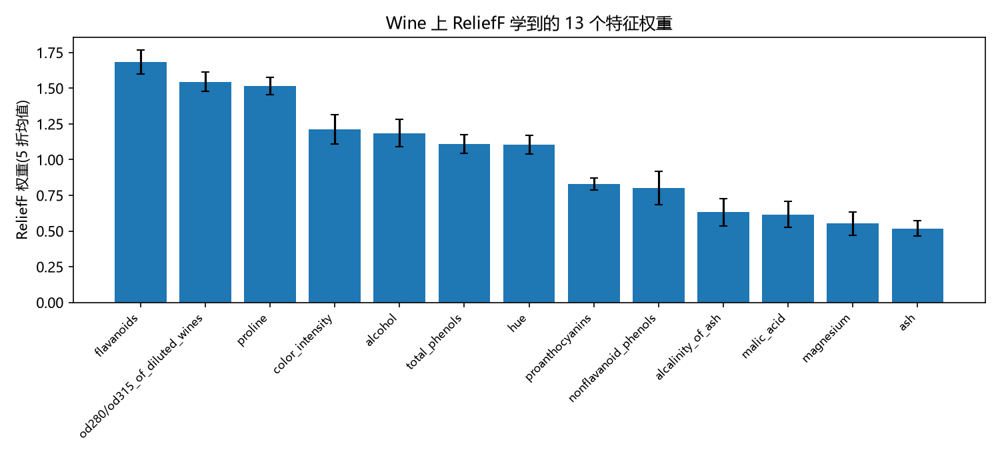{width=85%}

权重最高的两个特征 flavanoids 与 od280/od315 在数据中与 total_phenols 强相关(图 6,$r=0.865$、$r=0.787$)。

**白化投影**(图 11):标准化后 PCA 的前两个主成分解释 55.4% 的方差(PC1 36.2%、PC2 19.2%),投影由少数高方差方向主导;而 $\Sigma^{-1/2}$ 白化后全局协方差变为单位阵,每个方向恰好解释 7.69%($=1/13$)的方差,投影中三类样本的分布形态发生明显改变——马氏视角把"高方差方向"的天然优势抹平,迫使距离在解相关后的各向同性空间中度量。

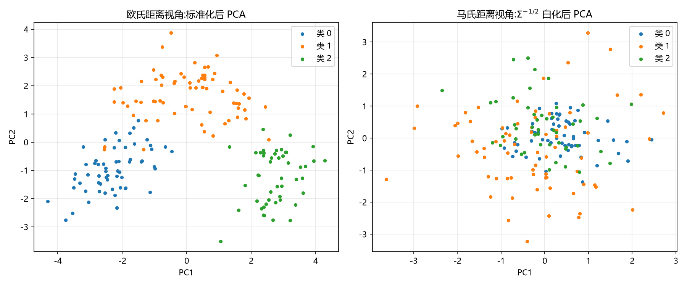{width=100%}

# 附录 C:手算例子复现

运行 `q2_task1_manual_check.py` 的输出:

```text
估计的协方差 Σ:
[[0.6667 0.    ]
 [0.     1.5833]]
马氏距离 d(x1,x3) = 2.449(期望 2.449),d(x2,x4) = 2.384(期望 2.384)
欧氏距离 d(x1,x3) = 2.000 < d(x2,x4) = 3.000,马氏给出相反排序(2.449 > 2.384)
ReliefF 平均权重 w = (29.5, 8.0, 48.5, 1.0)(期望 29.5, 8, 48.5, 1)
全部手算例子通过
```